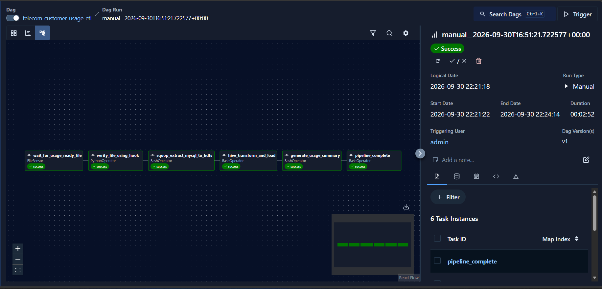

# Automated Telecom Customer Usage ETL Pipeline

An enterprise-grade Big Data ETL pipeline that ingests daily telecom customer usage metrics (call minutes, SMS, mobile data usage) from MySQL into Hadoop HDFS, applies SQL transformations using Apache Hive, and orchestrates the entire workflow using Apache Airflow.

---

## Pipeline Execution Overview



```text
               +-----------------------+
               |  MySQL (telecom_db)   |
               +-----------------------+
                           |
                           v
                     Apache Sqoop
                           |
                           v
                 Hadoop HDFS (/telecom)
                           |
                           v
                Apache Hive (telecom_dw)
                           |
                           v
              Customer Usage Fact & Summary
```
---

## Architectural & Theoretical Concepts
1. Ingestion Engine: Apache Sqoop
Relational-to-Hadoop Transfer: Apache Sqoop (SQL-to-Hadoop) is designed for efficiently transferring bulk data between relational databases (MySQL) and HDFS.

MapOnly Processing: Sqoop utilizes Hadoop MapReduce under the hood to perform parallel extraction. Since no aggregation happens during raw extraction, Sqoop executes as a Map-Only job, streaming database records directly into HDFS files.

Security & Credential Management: Database passwords are provided via file-based permission models (--password-file file://...) to prevent exposing raw credentials in system process tables (ps aux).

2. Storage Layer: Hadoop HDFS
Distributed File System: HDFS provides high-throughput streaming access to large datasets, storing raw relational extracts in an immutable format.

Raw Ingestion Directory: Sqoop outputs delimiter-separated text files into /telecom/raw/customer_usage, serving as the landing zone for downstream analytical compute engines.

3. Data Warehousing & Transformation Engine: Apache Hive
Schema-on-Read: Hive abstracts raw files in HDFS into structured relational tables using Schema-on-Read.

External vs. Internal Tables:

customer_usage_raw is configured as an EXTERNAL TABLE, ensuring that dropping or re-creating the table metadata in Hive does not delete the underlying raw data on HDFS.

customer_usage_fact and customer_usage_summary are internal managed tables optimized for analytical queries.

Data Cleansing & Aggregation: Transformations apply SQL functions (UPPER, domain validity filtering on metrics) to ensure data hygiene, producing clean dimensional and aggregated facts for reporting.

4. Orchestration Engine: Apache Airflow 3.x
Directed Acyclic Graphs (DAGs): Airflow manages execution order, dependencies, and retries programmatically via standard Python code.

Sensor-Based Event Driven Execution: Uses FileSensor to continuously monitor file system endpoints (usage.ready), ensuring downstream data processing starts only when data providers signal file availability.

FileSystem Hook (FSHook): Provides an abstraction layer for file system operations across local and distributed connections.

Modular Task Isolation: Each pipeline stage (wait, verify, ingest, transform, summarize) is decoupled into standalone operators (BashOperator, PythonOperator), enabling precise error domain isolation and granular retries.

## Tech Stack
Orchestration: Apache Airflow 3.x (FileSensor, FSHook, BashOperator, PythonOperator)

Ingestion: Apache Sqoop 1.4.7

Storage: Apache Hadoop HDFS 3.3.6

Data Warehouse: Apache Hive 3.1.3

Source Database: MySQL 8.0

OS Platform: WSL2 (Ubuntu 24.04 LTS)

## Airflow DAG Task Workflow
1. wait_for_usage_ready_file: FileSensor pokes the incoming directory for the usage.ready signal file.

2. verify_file_using_hook: PythonOperator leverages FSHook to validate file existence on the file path.

3. sqoop_extract_mysql_to_hdfs: Executes Sqoop import to pull raw relational metrics into /telecom/raw/customer_usage.

4. hive_transform_and_load: Triggers Hive HQL script to create raw external tables, clean metrics, and populate summary tables.

5. generate_usage_summary: Queries customer_usage_summary to print aggregated usage records in the log output.

6. pipeline_complete: Final completion checkpoint signifying pipeline success.
